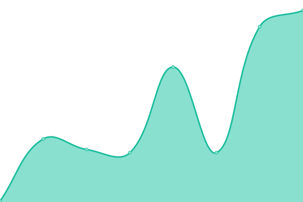
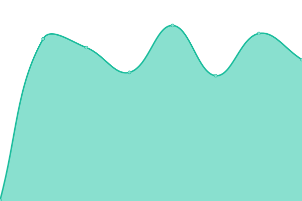

# [📈 Live Status](https://pluja.github.io/tenpo-open): <!--live status--> **🟧 Partial outage**

This repository contains the open-source uptime monitor and status page for [pluja](https://pluja.github.io/tenpo-open), powered by [Upptime](https://github.com/upptime/upptime).

With [Upptime](https://upptime.js.org), you can get your own unlimited and free uptime monitor and status page, powered entirely by a GitHub repository. We use [Issues](https://github.com/pluja/tenpo-open/issues) as incident reports, [Actions](https://github.com/pluja/tenpo-open/actions) as uptime monitors, and [Pages](https://pluja.github.io/tenpo-open) for the status page.

<!--start: status pages-->
<!-- This summary is generated by Upptime (https://github.com/upptime/upptime) -->
<!-- Do not edit this manually, your changes will be overwritten -->
<!-- prettier-ignore -->
| URL | Status | History | Response Time | Uptime |
| --- | ------ | ------- | ------------- | ------ |
|  [kycnot.me](https://kycnot.me) | 🟩 Up | [kycnot-me.yml](https://github.com/pluja/tenpo-open/commits/HEAD/history/kycnot-me.yml) | 

 600ms
     
 | 

<a href="https://pluja.github.io/tenpo-open/history/kycnot-me">100.00%</a>
    

|  [kycnot.me blog](https://blog.kycnot.me) | 🟩 Up | [kycnot-me-blog.yml](https://github.com/pluja/tenpo-open/commits/HEAD/history/kycnot-me-blog.yml) | 

 570ms
     
 | 

<a href="https://pluja.github.io/tenpo-open/history/kycnot-me-blog">100.00%</a>
    

|  [kycnot.me captcha](https://mcap.kycnot.me) | 🟥 Down | [kycnot-me-captcha.yml](https://github.com/pluja/tenpo-open/commits/HEAD/history/kycnot-me-captcha.yml) | 

 1055ms
     
 | 

<a href="https://pluja.github.io/tenpo-open/history/kycnot-me-captcha">73.68%</a>
    

|  [blogo.site](https://blogo.site) | 🟩 Up | [blogo-site.yml](https://github.com/pluja/tenpo-open/commits/HEAD/history/blogo-site.yml) | 

 2208ms
     
 | 

<a href="https://pluja.github.io/tenpo-open/history/blogo-site">99.76%</a>
    

|  [usenostr.org](https://usenostr.org) | 🟩 Up | [usenostr-org.yml](https://github.com/pluja/tenpo-open/commits/HEAD/history/usenostr-org.yml) | 

 245ms
     
 | 

<a href="https://pluja.github.io/tenpo-open/history/usenostr-org">100.00%</a>
    

|  [nerostr relay](https://xmr.usenostr.org) | 🟩 Up | [nerostr-relay.yml](https://github.com/pluja/tenpo-open/commits/HEAD/history/nerostr-relay.yml) | 

 461ms
     
 | 

<a href="https://pluja.github.io/tenpo-open/history/nerostr-relay">100.00%</a>
    

<!--end: status pages-->

[**Visit our status website →**](https://pluja.github.io/tenpo-open)

## 📄 License

- Powered by: [Upptime](https://github.com/upptime/upptime)
- Code: [MIT](./LICENSE) © [pluja](https://pluja.github.io/tenpo-open)
- Data in the `./history` directory: [Open Database License](https://opendatacommons.org/licenses/odbl/1-0/)
